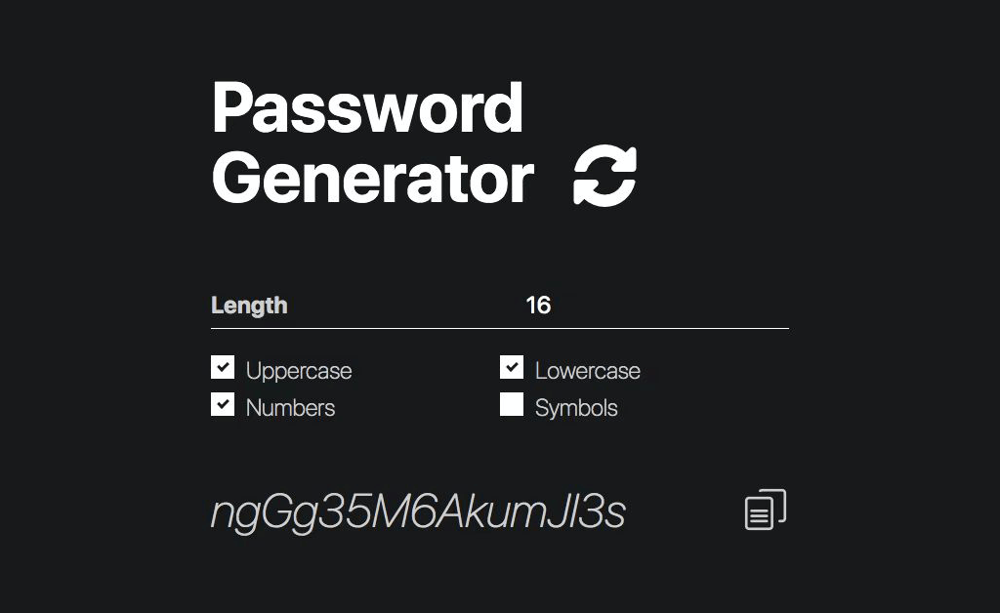

# Password Generator
> 🗝️ Create a secure password in seconds, with a greater length  
> <https://password.yelo.ooo/>



## Features
- 🔐 Cryptographically Strong Random with [Crypto WebAPI](https://developer.mozilla.org/en-US/docs/Web/API/Crypto/getRandomValues) (via [sindresorhus/crypto-random-string](https://github.com/sindresorhus/crypto-random-string)) 
- 🌡️ Up to 1024 characters per combination
- 💾 Auto-Save last preset in local
- 🔗 Persistent URLs for Saving & Sharing presets
- 🙈 Completely Static, No server communication but only JavaScript
- 🧹 No Ads, No Annoying Popups

## Online Version
<https://password.yelo.ooo/>

## Development
### Install dependencies
```bash
$ yarn
```

### Launch Local Server
```bash
$ yarn start
```

### Build
```bash
$ yarn build
```

### Deploy
```bash
$ yarn gh-pages
```

## License
Apache-2.0 &copy; [yelo](https://github.com/imyelo), 2020 - present
